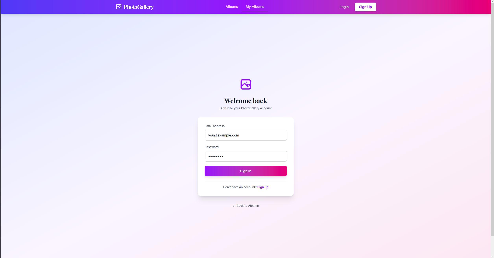
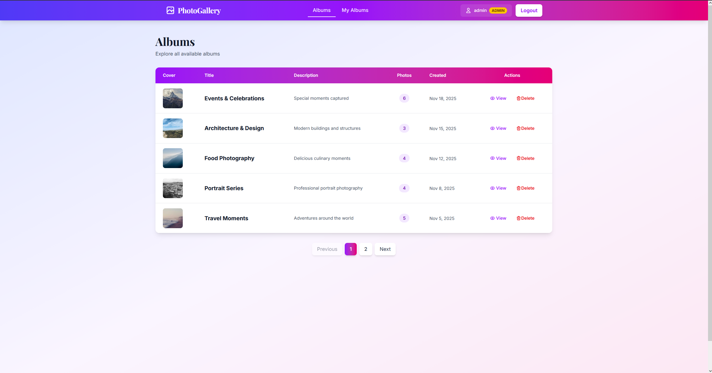
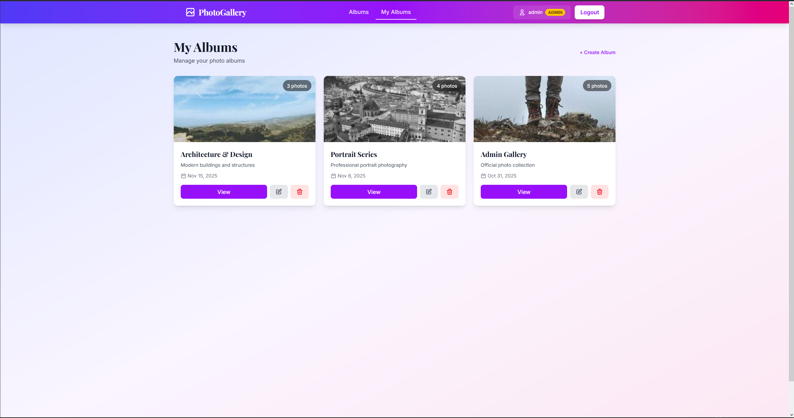
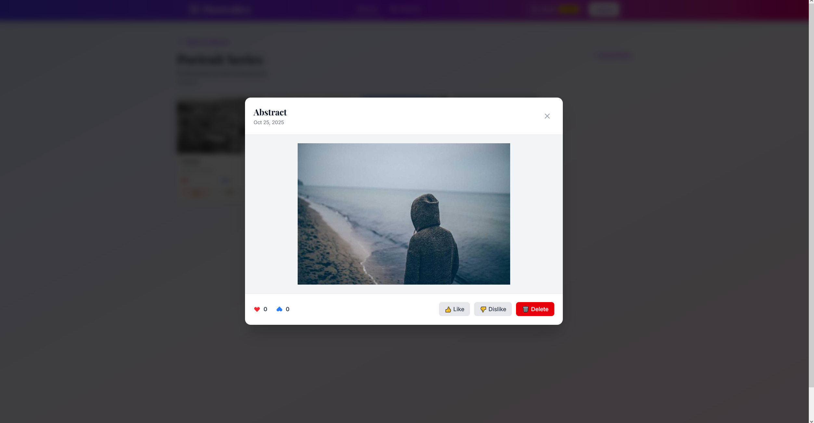

# PhotoGallery - Full-Stack Photo Management Test Application

A modern full-stack web application for uploading, organizing, and sharing photos with album management, user authentication, and social features (likes/dislikes).


## ✨ Features

### Core Functionality
- **🔐 User Authentication & Authorization**
  - Secure login/registration with ASP.NET Identity
  - Role-based access control (Admin, User, Anonymous)
  - JWT token-based authentication

- **📁 Album Management**
  - Create, view, and delete albums
  - Albums list with pagination
  - Dynamic cover photos (first image in album)
  - User-specific album management

- **🖼️ Photo Management**
  - Upload photos with automatic thumbnail generation (SixLabors ImageSharp)
  - View photos in gallery with pagination
  - Full-sized photo preview on click
  - Delete photos (owner or admin only)

- **👍 Social Features**
  - Like/dislike photos
  - Real-time like/dislike counters
  - User-specific like/dislike tracking

- **🛡️ Authorization & Security**
  - Multi-layer security (Frontend UI + Backend API)
  - Album ownership verification
  - Admin override capabilities
  - 403 Forbidden responses for unauthorized actions

## 📸 Screenshots

### Login Page


### Albums Gallery


### My Albums


### Photo Preview & Interactions


## 🏗️ Tech Stack

### Backend
| Technology | Version | Purpose |
|-----------|---------|---------|
| ASP.NET Core | 9.0 | Web API Framework |
| Entity Framework Core | Latest | ORM & Database Access |
| PostgreSQL | 17+ | Primary Database |
| ASP.NET Identity | 9.0 | Authentication & Authorization |
| SixLabors ImageSharp | Latest | Image Processing & Thumbnails |
| FluentValidation | Latest | Input Validation |
| xUnit | Latest | Unit Testing Framework |
| AutoFixture | Latest | Test Data Generation |
| FluentAssertions | Latest | Fluent Test Assertions |
| Moq | Latest | Mocking Framework |

### Frontend
| Technology | Version | Purpose |
|-----------|---------|---------|
| Angular | 20+ | Frontend Framework |
| TypeScript | Latest | Type-safe JavaScript |
| TailwindCSS | Latest | Utility-first CSS Framework |

### Development Tools
- Visual Studio / VS Code
- Git & GitHub
- Postman / Swagger

## 🏛️ Architecture

### Clean Architecture Principles (Backend)
```
PhotoGallery/
├── PhotoGallery.Api/          # Entry point, Controllers
├── PhotoGallery.Application/  # Business Logic, DTOs, Validators, Services, Interfaces
├── PhotoGallery.Domain/       # Entities
├── PhotoGallery.Infrastructure/ # EF Core, Repositories, External Services
├── PhotoGallery.Tests/        # Unit Tests
```

## 🚀 Getting Started

### Prerequisites
- **.NET 9 SDK** - [Download](https://dotnet.microsoft.com/download)
- **Node.js 20+** - [Download](https://nodejs.org/)
- **PostgreSQL 14+** - [Download](https://www.postgresql.org/)
- **Git** - [Download](https://git-scm.com/)

### Backend Setup

1. **Clone Repository**
```bash
git clone https://github.com/vladyslavplus/photogallery-inforce.git
cd photogallery-inforce
```

2. **Configure Database**
```bash
# Create appsettings.json with database connection
cat > PhotoGallery.Api/appsettings.json << EOF
{
  "ConnectionStrings": {
    "DefaultConnection": "Host=localhost;Port=5432;Database=photogallery;Username=postgres;Password=yourpassword"
  },
  "Jwt": {
    "SecretKey": "your-very-long-secret-key-at-least-32-characters",
    "ExpirationMinutes": 60
  }
}
EOF
```

3. **Setup Database**
```bash
# Navigate to API project
cd PhotoGallery.Api

# Create database and apply migrations
dotnet ef database update

# Return to root
cd ..
```

4. **Run Backend**
```bash
cd PhotoGallery.Api
dotnet run
```
Backend will be available at `https://localhost:7129`

### Frontend Setup

1. **Navigate to Angular Project**
```bash
cd PhotoGallery-client
```

2. **Install Dependencies**
```bash
npm install
```

3. **Configure API Endpoint**
Edit `src/environments/environment.ts`:
```typescript
export const environment = {
  production: false,
  apiUrl: 'https://example:7129'
};
```

4. **Run Frontend**
```bash
ng serve
```
Frontend will be available at `http://localhost:4200`

### Access the Application

- **Anonymous**: `http://localhost:4200/albums`
- **Login**: Use credentials created during registration
  - Admin user for testing: Use registration + promote to admin via database
- **My Albums**: `http://localhost:4200/my-albums` (requires login)

## 🗄️ Database Schema

### Key Relationships
- **User → Album**: One-to-Many (1 user can have many albums)
- **Album → Photo**: One-to-Many (1 album can have many photos)
- **Photo → PhotoLike**: One-to-Many (1 photo can have many likes/dislikes)
- **User → PhotoLike**: One-to-Many (1 user can like/dislike many photos)

## 🧪 Testing

### Unit Tests

Run unit tests:
```bash
cd PhotoGallery.Tests
dotnet test
```

Test coverage includes:
- **Service Layer**: Business logic validation

### Test Tools
- **xUnit**: Testing framework
- **AutoFixture**: Automatic test data generation
- **FluentAssertions**: Readable test assertions
- **Moq**: Object mocking